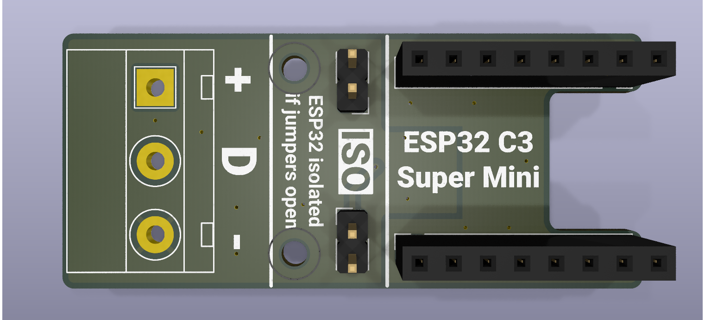
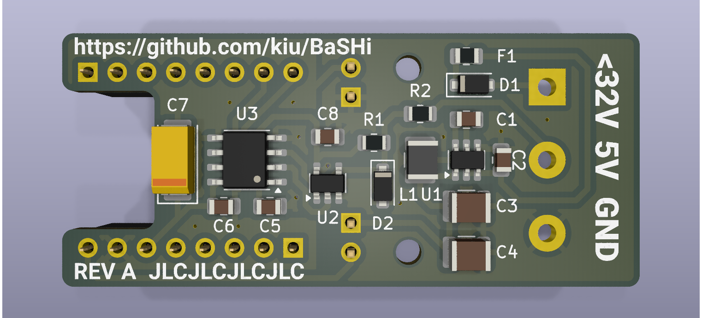

# BaSHi
BaSHi - Bidirectional adapter for Sniffing Home appliances (isolated)

[Hajo](https://github.com/hn/) gave a [talk](https://media.ccc.de/v/39c3-hacking-washing-machines) on hacking home appliances at the [39C3](https://events.ccc.de/congress/2025/infos/startpage.html).

# Files
- [kicad](REV_A/kicad/): KiCad schematic, board and gerbers
- [BOM](REV_A/kicad/BaSHi-bom.ods): Bill of materials (ODS)
- [BOM](REV_A/kicad/BaSHi-bom.pdf): Bill of materials (PDF)
- [datasheets](REV_A/datasheets/): Datasheets of main components
- [Sketch](bsh-dbus-logger/): Adapted arduino sketch

# Links
- https://github.com/hn/bsh-home-appliances/
- https://media.ccc.de/v/39c3-hacking-washing-machines
- https://de.wikipedia.org/wiki/RAST-Steckverbinder
- https://www.espboards.dev/esp32/esp32-c3-super-mini/

# License
This project is licensed under the Creative Commons Attribution-NonCommercial 3.0 Unported (CC BY-NC 3.0) license.
