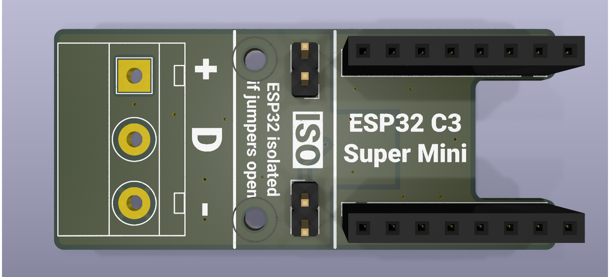
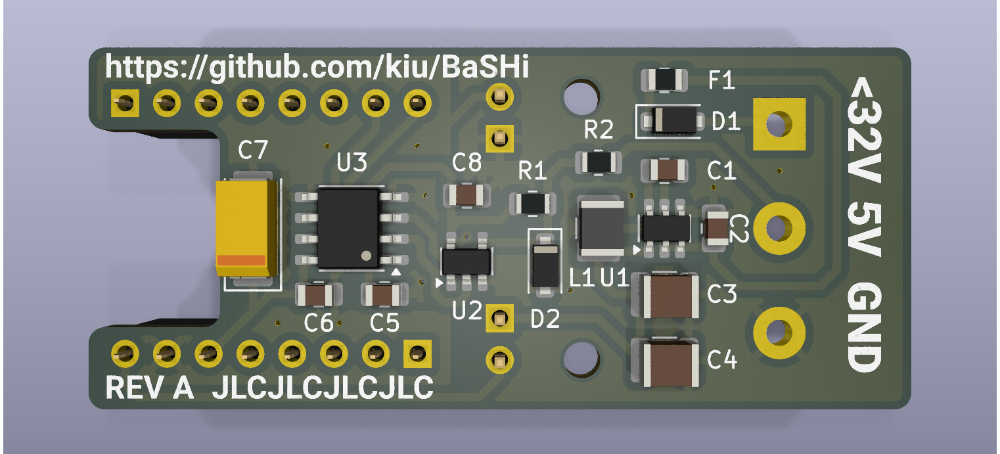

# BaSHi
BaSHi - Bidirectional adapter for Sniffing Home appliances (isolated)

WARNING - THIS IS AN UNTESTED PROTOTYPE - WILL UPDATE ONCE FUNCTIONALITY HAS BEEN VERIFIED

REV A semms to do what it needs to do, but its a FAIL. Wrong footprints and isolation distance missing. New REV B is in the works.

[Hajo](https://github.com/hn/) gave a [talk](https://media.ccc.de/v/39c3-hacking-washing-machines) on hacking home appliances at the [39C3](https://events.ccc.de/congress/2025/infos/startpage.html). That talk inspired me to build a simple, isolated, bidirectional D-Bus adapter to make tinkering with these devices easier.

# Warning
> [!WARNING]
> Household appliances work with high voltages and currents. They generate heat and steam, they shake, vibrate and have rotating parts. You should have a good knowledge of electrics and take appropriate safety measures before opening or modifying such an appliance. Parts can get wet or hot, move or fall off.

> [!WARNING]
> Even if parts of the appliances operate at low voltages, depending on your specific model they may or may not be isolated from earth. This is a good chance of death or serious injury.
> I'm not responsible if you kill your cat, your spouse, your favourite pet fish, or yourself, whichever of these is the worst for you. You have been warned.

# Usage
BaSHi can operate in two modes.

In <ins>non-isolated</ins> mode, the ESP32 is powered by the home appliance. The two jumpers must be shorted. This mode is intended for standalone operation. Do not connect the ESP32 USB port while BaSHi is connected to a home appliance.

In <ins>isolated</ins> mode, the ESP32 is electrically isolated from the home appliance. The two jumpers must be left open. This mode is intended for use during development. The ESP32 must be powered via USB.

# Files
- [kicad](REV_A/kicad/): KiCad schematic, board and gerbers
- [BOM](REV_A/BaSHi-bom.ods): Bill of materials (ODS)
- [BOM](REV_A/BaSHi-bom.pdf): Bill of materials (PDF)
- [datasheets](REV_A/datasheets/): Datasheets of main components
- [Sketch](bsh-dbus-logger/): Adapted arduino sketch

# Links
- https://github.com/hn/bsh-home-appliances/
- https://media.ccc.de/v/39c3-hacking-washing-machines
- https://de.wikipedia.org/wiki/RAST-Steckverbinder
- https://www.espboards.dev/esp32/esp32-c3-super-mini/

# Improvements
Improvement ideas for future revisions:
- Replace inductor with cheaper version
- Replace ISO7321C with cheaper version
- Rename power nets to something like +5V_AP, +5V_USB, +3V3_ESP
- Boards for C3, S3, C6 and H2 boards
- More compact terminal connector
- Add LEDs for power and data

# License
This project is licensed under the Creative Commons Attribution-NonCommercial 3.0 Unported (CC BY-NC 3.0) license.
