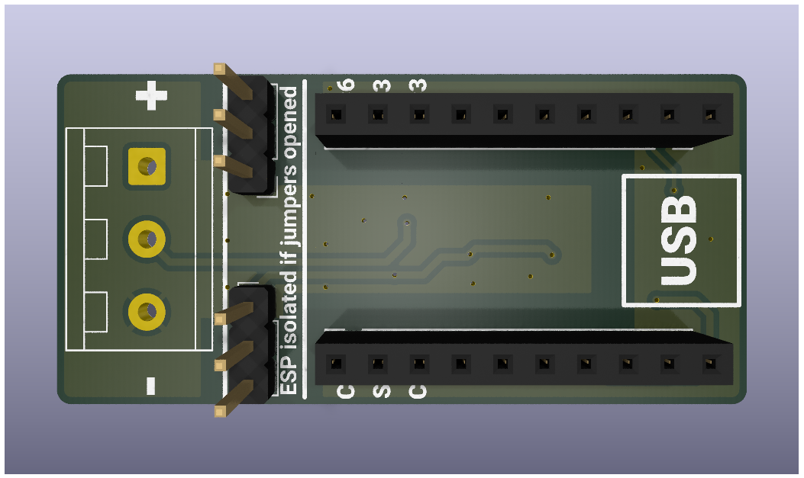
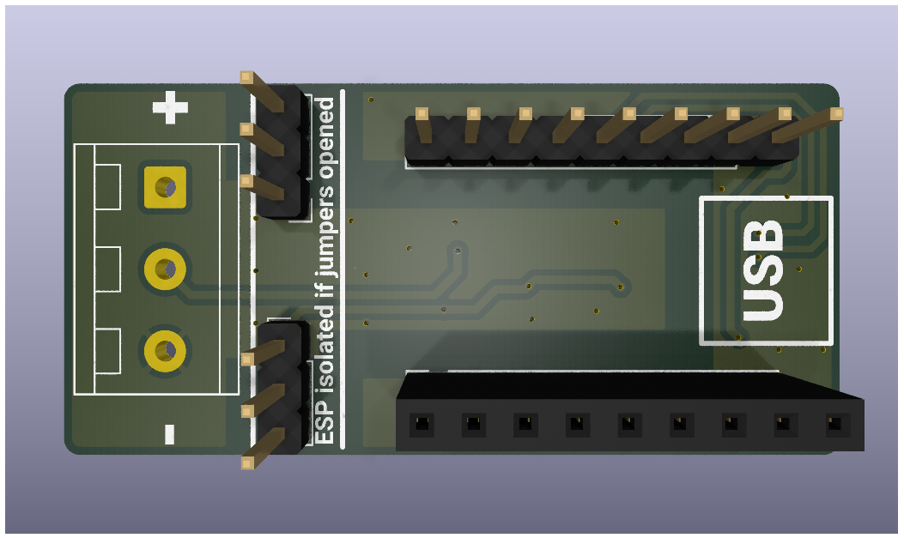

# BaSHi
BaSHi - Bidirectional adapter for Sniffing Home appliances (isolated)

[Hajo](https://github.com/hn/) gave a [talk](https://media.ccc.de/v/39c3-hacking-washing-machines) on hacking home appliances at the [39C3](https://events.ccc.de/congress/2025/infos/startpage.html). That talk inspired me to build a simple, isolated, bidirectional D-Bus adapter to make tinkering with these devices easier.

# Warning
> [!WARNING]
> Household appliances work with high voltages and currents. Even if parts of the appliances operate at low voltages, they may or may not be isolated from earth and in case of a fault, can expose dangerous voltages. There is a good chance of death or serious injury. They might generate heat and steam, shake, vibrate, have rotating parts and get wet. Take appropriate safety measures.

| :zap: I'm neither responsible nor liable if you kill your cat, your spouse, yourself, or set your house on fire. You have been warned. BaSHi is intended to be used by experts, e.g., electricians.  |
|------------------------------------------|

# Usage
BaSHi can operate in two modes.

In <ins>non-isolated</ins> mode, the ESP32 is powered by the home appliance. Both jumpers must be shorted. This mode is intended for standalone operation. Do not connect the ESP32 USB port while BaSHi is connected to a home appliance.

In <ins>isolated</ins> mode, the ESP32 is electrically isolated from the home appliance. Bothe jumpers must be left open. This mode is intended for development. The ESP32 must be powered via its USB port.

Hint: Once you have identified the wires carrying D-BUS, use quick splice connectors (commonly used in automotive applications) to tap in BaSHi.

# Variants
BaSHi comes in two variants. Choose the variant based on the ESP32 board you want to use.

Note: While layout and pin usage differ between the two PCB variants, they share the same stencil, enclosure, and components (with the exception of J4 and J5).

## BaSHi-SM-1

Install: BaSHi-SM-1 is compatible with ESP32 boards of varying pin counts. The board must be bottom-aligned with the USB port at the lowest pin; the markings at the top provide additional guidance.

- [KiCad](BaSHi-SM-1/REV_A/kicad/): KiCad [schematic](BaSHi-SM-1/REV_A/BaSHi-SM-1-schematic.png), board and gerbers
- Compatibility: [ESP32 C3 Super Mini](https://www.espboards.dev/esp32/esp32-c3-super-mini/), [ESP32 C3 Super Mini Plus](https://www.espboards.dev/esp32/esp32-c3-super-mini-plus/), [ESP32 C6 Super Mini](https://www.espboards.dev/esp32/esp32-c6-super-mini/) and [ESP32 S3 Super Mini](https://www.espboards.dev/esp32/esp32-s3-super-mini/)

## BaSHi-ZERO-1

Install: For BaSHi-ZERO-1, all compatible ESP32 boards share the same pin count. Ensure the board is bottom-aligned with the USB port at the lowest pin.

- [KiCad](BaSHi-ZERO-1/REV_A/kicad/): KiCad [schematic](BaSHi-ZERO-1/REV_A/BaSHi-ZERO-1-schematic.png), board and gerbers
- Compatibility: [ESP32 C3 Zero](https://www.espboards.dev/esp32/esp32-c3-zero/), [ESP32 C6 Zero Mini](https://www.espboards.dev/esp32/esp32-c6-zero-mini/), [ESP32 S3 Zero](https://www.espboards.dev/esp32/esp32-s3-zero/)

## Common Files
The following files apply to both BaSHi variants.

- [Sketch](common/bsh-dbus-logger/): Adapted Arduino sketch (Bus2USB Bridge)
- [Mech](common/mech/): Simple OpenSCAD enclosure
- [BOM](common/BaSHi-boms.ods): Bills of materials [(PDF)](common/BaSHi-boms.pdf)
- [Datasheets](common/datasheets/): Datasheets of main components

# Links
- https://github.com/hn/bsh-home-appliances/
- https://media.ccc.de/v/39c3-hacking-washing-machines
- https://de.wikipedia.org/wiki/RAST-Steckverbinder

# License
This project is licensed under the Creative Commons Attribution-NonCommercial 3.0 Unported (CC BY-NC 3.0) license.
